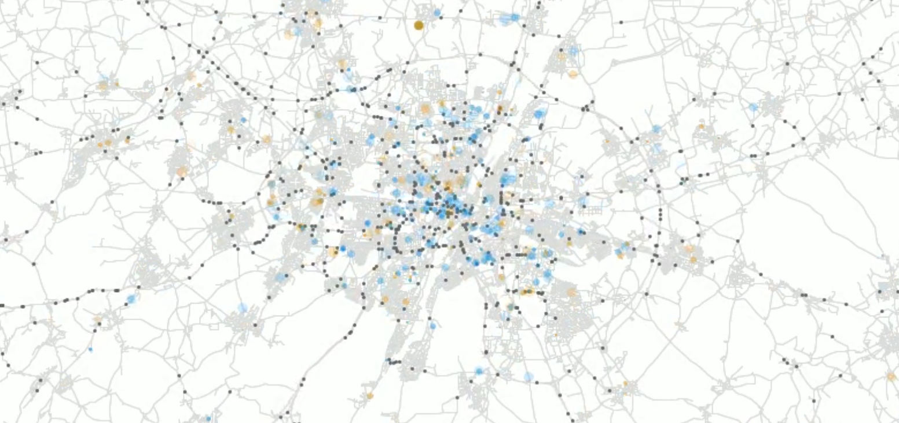

# An open synthetic population of Munich

This repository contains the code to create an open data synthetic population
for Munich, Germany. It has been a joint project result between *IRT SystemX* and *TU Munich*.

## Main reference

It is based on a methodolgy that was originally developed for the Île-de-France region in Paris:

> Hörl, S. and M. Balac (2021) [Synthetic population and travel demand for Paris and Île-de-France based on open and publicly available data](https://www.sciencedirect.com/science/article/pii/S0968090X21003016), _Transportation Research Part C_, **130**, 103291.

## What is this?

This repository contains the code to create an open data synthetic population
of Munich.
It takes as input several publicly
available data sources to create a data set that closely represents the
socio-demographic attributes of persons in the region, as well
as their daily mobility patterns. Those mobility patterns consist of activities
which are performed at certain locations (like work, education, shopping, ...)
and which are connected by trips with a certain mode of transport. It is known
when and where these activities happen.

Such a synthetic population is useful for many research and planning applications.
Most notably, such a synthetic population serves as input to agent-based
**transport simulations**, which simulate the daily mobility behaviour of people
on a spatially and temporally detailed scale. Moreover, such data has been used
to study the **spreading of diseases**, or the **placement of services** and facilities.

The synthetic population for Munich can be generated from scratch by
everybody who has basic knowledge in using Python. Detailed instructions
on how to generate a synthetic population with this repository are available below.

Although the synthetic population is independent of the downstream application
or simulation tool, we provide the means to create an input population for the
agent- and activity-based transport simulation framework [MATSim](https://matsim.org/).

This pipeline has been adapted to many other regions and cities around the world
and is under constant development. It is released under the GPL license, so feel free
to make adaptations, contributions or forks as long as you keep your code open
as well!

## Documentation

This pipeline fulfils two purposes: First, to create synthetic populations
of Munich in *CSV* and *GLPK* format including persons
and their daily localized activities. Second, the pipeline makes use of
infrastructure data to generate the inputs to agent-based transport simulations.
These steps are described in the following documents:

- [How to create a synthetic population of Munich](docs/population.md)
- [How to run a MATSim simulation of Munich](docs/simulation.md)
